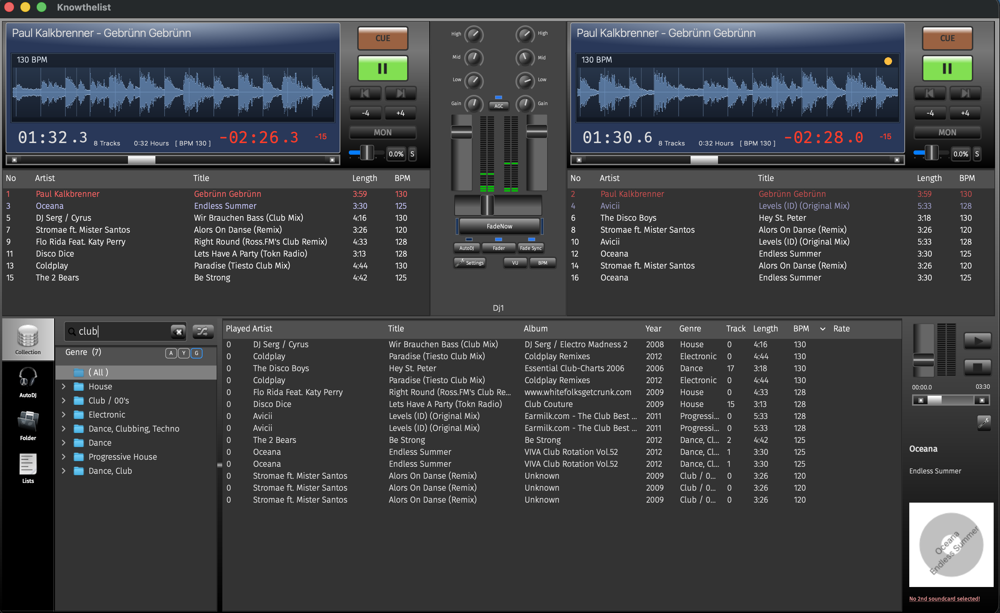

# knowthelist


---

### The Ultimate Party DJ Mixer — Know Your List, Own the Night

**Knowthelist** is a feature-packed, cross-platform DJ mixer and music player built for DJs and party hosts who need to **react instantly** while mixing. Queue up your crowd's requests in real-time, beat-sync two decks, set auto-DJ filters, and deliver flawless transitions — all with a beautiful, responsive interface.

---

## Features

| What | Why It Rocks |
|------|-------------|
| **Dual Decks** | Two independent players with separate playlists for seamless mixing |
| **Live Collection Search** | Find any track instantly while music plays — guests can type requests too |
| **Full Mixer** | Crossfader, 3-band EQ per deck, and per-channel gain control |
| **Beat Sync** | Visual sync support with gradual tempo restoration and latency compensation |
| **Auto DJ** | Smart random play with powerful filters — set it and forget it |
| **Track Analysis** | Automatic BPM detection, loudness mapping, cue points & beat phase visualization |
| **Monitor Player** | Pre-listen on a secondary audio device before dropping tracks |
| **Pitch-Preserving Time Stretch** | DJ-style tempo changes with pitch preservation |
| **Auto Gain Control (AGC)** | Keep energy levels consistent across your set |
| **Modern UI** | Fancy tabs, custom VU meters, progress bars, rating widgets — all with Fira Sans typography |

---

## Screenshot



> Runs natively on **Linux**, **macOS** and **Windows**.

---

## Building from Source

### Prerequisites

| Dependency | Purpose |
|------------|---------|
| [Qt 6](https://www.qt.io/) (Core + GUI + SVG) | UI framework |
| [CMake ≥ 3.16](https://cmake.org/) | Build system |
| [taglib](http://taglib.github.io) | Audio metadata |
| **JUCE** (auto-fetched by CMake) | Pure JUCE audio backend |
| **soundtouch** | Pitch-preserving tempo |

---

### Linux (Debian / Ubuntu)

```bash
# 1. Install system dependencies
sudo apt install build-essential cmake qt6-base-dev qt6-base-dev-tools \
    libtag1-dev libasound2-dev ladspa-sdk soundtouch-devel

# 2. Get the source
git clone https://github.com/knowthelist/knowthelist.git
cd knowthelist

# 3. Build with CMake (recommended)
cmake -S . -B build
cmake --build build -j$(nproc)

# 4. Run
./build/knowthelist
```

> **JUCE cache:** JUCE is cached outside `build/` (default: `~/.cache/knowthelist/fetchcontent` on Linux/macOS). Running `rm -rf build` won't re-download it. Override with `-DKNOWTHELIST_FETCHCONTENT_DIR=/path/to/cache`.

---

### macOS

```bash
# 1. Install dependencies via Homebrew
brew install qt taglib soundtouch

# 2. Get the source
git clone https://github.com/knowthelist/knowthelist.git
cd knowthelist

# 3a. qmake build
qmake6 && make -j$(sysctl -n hw.ncpu)

# 3b. Or CMake (recommended)
cmake -S . -B build && cmake --build build -j$(sysctl -n hw.ncpu)

# 4. Run
./build/knowthelist
```

The app compiles to a `.app` bundle — drop it into `/Applications`. An icon will appear in Spotlight.

---

### Windows

1. Install [Qt 6+](https://www.qt.io/download) (incl. Qt Creator) and [CMake](https://cmake.org).
2. Build [taglib](http://taglib.github.io) with CMake, then add its `bin` path to your Qt Creator build environment.
3. Open the project in **Qt Creator** → Build & Run (Ctrl+R).

> A prebuilt Windows package is also available on the [Releases page](https://github.com/knowthelist/knowthelist/releases).

---

## Installing Packages

### Linux (via `apt`)

```bash
sudo apt install knowthelist
```

Pre-built Linux packages are also available on the [Releases page](https://github.com/knowthelist/knowthelist/releases).

### macOS & Windows

Download the latest installer from the [Releases page](https://github.com/knowthelist/knowthelist/releases).

---

## Regenerating UI Headers

UI headers are generated by Qt Designer — **do not edit them manually**.

```bash
# CMake (recommended):
cmake -S . -B build && cmake --build build --target knowthelist_autogen

# Force full regenerate:
rm -rf build && cmake -S . -B build && cmake --build build -j

# qmake:
qmake6 knowthelist.pro && make clean && make -j
```

---

## Version History

| Version | Date | Highlights |
|---------|------|------------|
| 2.4 | 2026 | Qt 6, BPM mode detection, pure JUCE audio backend, beat-phase visualizer |
| 2.3 | 2014-09 | Qt 5 compatibility, GStreamer 1.x |
| 2.2 | 2014-08 | Stored playlists support |
| 2.1 | 2014-05 | First public release; qt3support removal |
| 2.0 | 2011 | Qt-only + GStreamer for multi-platform |
| 1.x | 2005 | KDE/Linux only (Arts sound framework) |

---

[](LICENSE)
[](https://cmake.org/)
[](https://www.qt.io/)
[]()
